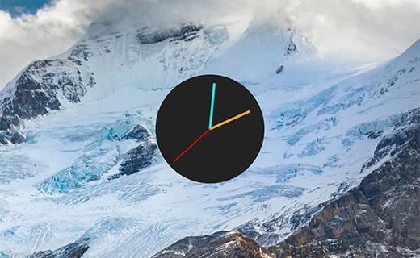

# Valerian Time

An [Übersicht](https://github.com/felixhageloh/uebersicht) clock widget based on [a pen](http://codepen.io/TheRealAlan/pen/zCdbH) by [Allan Crissey](https://github.com/TheRealAlan/). Comissioned by [Valéria Boikova](http://www.valeriaboikova.com/).

## Installation

Click the **Übersicht Icon** > **Open Widgets Folder** to open the Widgets directory. Copy the *valerian-time.widget* folder there.
